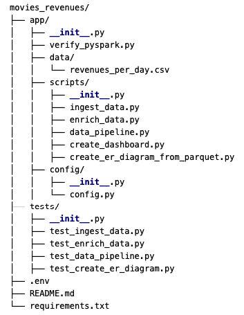

# Movie Revenue Analysis

This project ingests daily movie revenue data, enriches it with additional information from the OMDb API, and creates a data model to analyze the data. The project is built using Apache Spark and Python, and includes a simple dashboard to visualize movie rankings based on revenue.

## Requirements

Whole list inside requirements.txt

## Setup

1. Create a virtual environment:
    ```bash
    python3.11 -m venv venv
    ```

2. Activate the virtual environment:
    - On Windows:
        ```bash
        venv\Scripts\activate
        ```
    - On macOS and Linux:
        ```bash
        source venv/bin/activate
        ```

3. Install required Python packages:
    ```bash
    pip install -r requirements.txt
    ```

4. Install Graphviz:
    - macOS:
        ```bash
        brew install graphviz
        ```
    - Ubuntu/Linux:
        ```bash
        sudo apt-get install graphviz
        ```
    - Windows:
        Download and install from [Graphviz Download](https://graphviz.gitlab.io/download/), and add the Graphviz `bin` directory to your system's PATH.

5. Register for an OMDb API key [here](https://www.omdbapi.com/apikey.aspx).

6. Create a `.env` file in the root directory and add your API key:
    ```env
    OMDB_API_KEY=YOUR_OMDB_API_KEY
    ```
## Configuration

The `config.py` file in the `app/config` directory contains several configuration settings for the project:

## Running the Project

1. Ingest and enrich data:
    ```bash
    python scripts/enrich_data.py
    ```

2. Implement the data pipeline:
    ```bash
    python scripts/data_pipeline.py
    ```

3. Create the dashboard:
    ```bash
    python scripts/create_dashboard.py
    ```

4. Create the ER diagram:
    ```bash
    python scripts/create_er_diagram_from_parquet.py
    ```

## Running Tests

Run script run_tests.py to execute the tests in the specified order:

```bash
python tests/run_tests.py
```

**Project Structure**

